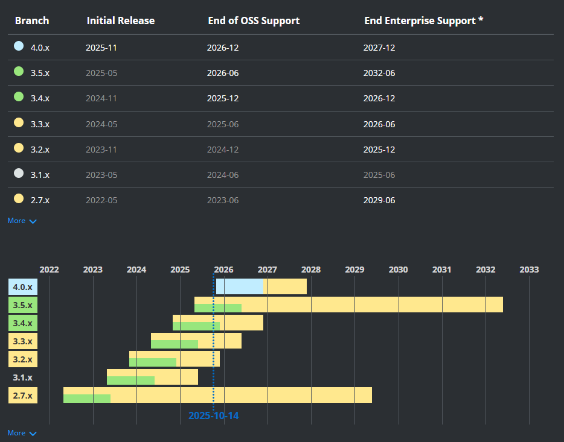

# big_event

黑马程序员大事件小项目跟练

### spring boot 版本选择



### 参数校验

使用SpringValidation，对注册接口的参数进行合法性校验

1. 引l入 Spring Validation 起步依赖
   ```xml
    <dependency>
        <groupId>org.springframework.boot</groupId>
        <artifactId>spring-boot-starter-validation</artifactId>
    </dependency>
   ```
2. 在 Controller 类上添加 @Validated 注解
3. 在参数前面添加 @Pattern 注解

常用 参数校验注解

- Pattern
- Size
- NotBlank
- NotNull
- Length
- URL
- Past
-  Future
-  Email

### 自定义参数校验器


### JWT 登录校验

- 创建拦截器
  - 创建一个 Component 类继承 HandlerInterceptor
  - 实现 preHandler 方法和 postHandler 方法
  - 创建一个 拦截器配置类 Configuration 继承 WebMvcConfigurer
  - 重写 addInterceptors 方法
  - 在方法中添加拦截器


- 注册拦截器


### 多环境配置文件管理

1. 单文件配置
   - 在 yml 中用 --- 分割会不同的环境配置
   - 在第一个部分中通过 spring.profiles.active 指定当前环境
   - 在其他的部分中通过 spring.config.activate.on-profile 指定当前环境名称
2. 多文件配置
    - 在 resources 文件夹下创建 application-{环境名称}.yml 文件
    - 在 application.yml 中通过  spring.profiles.active 指定当前环境
3. 多环境分组
    - 在 resources 文件夹下创建 application-{分组环境名称}.yml 文件
    - 在 application.yml 中通过  spring.profiles.group 指定当前环境分组
    - 在 spring.profiles.active 指定当前分组


### git commit message 轻量级规范

```text
<type>[optional scope]: <description>

[optional body]

[optional footer(s)]
```


### 使用 redis

0. 安装 redis
```yml
services:
  redis:
    image: redis:7.0
    ports:
      - "6379:6379"
    command: redis-server --appendonly yes
    volumes:
      - redis_data:/data
    restart: unless-stopped

```

1. 引入 redis 起步依赖\
```xml
<dependency>
    <groupId>org.springframework.boot</groupId>
    <artifactId>spring-boot-starter-data-redis</artifactId>
</dependency>

```
2. 配置 redis
```yml
spring:
  data:
    redis:
      host: localhost
      port: 6379
      password: <PASSWORD>
      database: 0
```

**type**

- feat：引入新功能；
- test：测试的包含或修正；
- chore：不影响生产代码的更新，涉及工具、配置或库调整；
- docs：对文档文件的添加或修改；
- style：与代码呈现相关的调整，例如格式和空白；
- build：影响构建系统或外部依赖项的修改；
- fix：修复软件错误；
- refactor：用于代码更改，保留其整体功能；
- perf：代码更改提高性能；
- ci： CI 配置文件和脚本的更改；
- env：描述 CI 流程中配置
